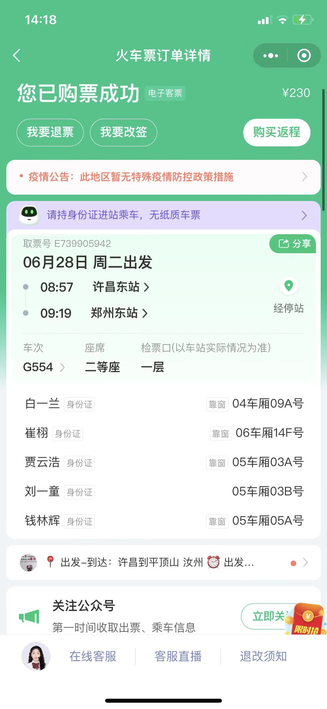

## 郑州避暑夏日企划

更新于2022/6/27 15：00

**写在前面的话**

+ <mark>见面勿提胖瘦</mark>

+ 6月27日做核酸检测，不然上不了高铁

+ 关于水的东西可以到了再买

+ 郑州防疫政策 ：

  （四）中高风险地区所在地市的其他县（市、区）和14天内有本土病例报告地市的其他县（市、区）流入人员。来（返）郑需持有48小时内核酸检测阴性证明，落地后24小时内开展一次核酸检测，之后按照郑州市常态化核酸检测要求开展核酸检测。

  （五）确诊病例或无症状感染者的时空伴随者。实施“7天居家健康监测”。

  （六）其他低风险地区流入人员。入郑后查验健康码、行程码，并按照郑州市常态化核酸检测频次要求开展核酸检测。

### 景点

[**银基乐海水世界**](https://www.dahepiao.com/lvyounews1/20220526274256.html)

简介：银基乐海水世界位于郑州银基国际旅游度假区项目内，AAAAA级景区

[**方特**](http://zhengzhou.fangte.com/adventure/)

简介：郑州方特欢乐世界是一个以高科技为主要表现形式的文化科技主题公园]。

<video id="video" controls="" preload="none" width="400"  controls="controls" style="width= 50%; height=100%; object-fit: fill">
    <source id="mp4" src="./source/fangte.mp4">
</video>

[**郑州绿博园**](http://www.zzzglby.com/)

简介：郑州·中国绿化博览园位于郑州新区绿博大道，为国家级AAAA旅游景区。

### 住宿

郑州市金水区民宿2晚

### 交通

**临颍到许昌**

临颍出发的各位，明天早上7：45前在县政府广场南面即步行街北面集合，我开小破车去许昌。

**许昌到郑州**

**返程**

待定

### 人员

白一兰、刘一童、崔栩、贾云浩、钱林辉、李冲豪（28日晚在郑州加入我们）

